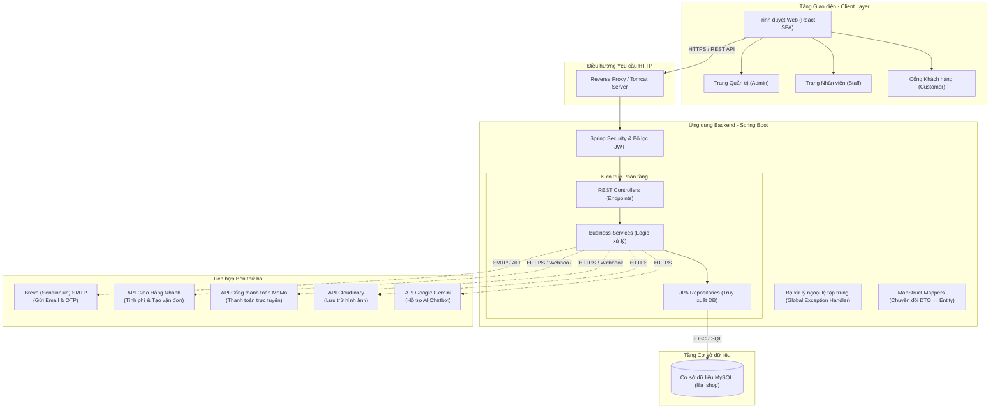

# Sơ đồ Kiến trúc Hệ thống

Tài liệu này trình bày thiết kế kiến trúc của nền tảng LilaShop, minh họa cách thức giao tiếp giữa frontend, backend, cơ sở dữ liệu và các dịch vụ tích hợp bên thứ ba.

## Kiến trúc Hệ thống Tổng quan

## Các Thành phần Kiến trúc

### 1. Tầng Giao diện (React Frontend)
- Xây dựng dưới dạng ứng dụng đơn trang (SPA - Single Page Application).
- Sử dụng **React Router** để quản lý điều hướng phía client.
- Sử dụng **React Context API** để quản lý trạng thái toàn cục (như trạng thái giỏ hàng, thông tin đăng nhập của người dùng).
- Giao diện phân quyền theo vai trò:
  - **Cổng Khách hàng**: Xem sản phẩm, đặt hàng, viết đánh giá và chat trực tuyến với hỗ trợ viên.
  - **Trang Nhân viên**: Quản lý các yêu cầu hỗ trợ (tickets), kiểm duyệt đánh giá sản phẩm và cập nhật trạng thái đơn hàng.
  - **Trang Quản trị (Admin)**: Xem số liệu thống kê tài chính chi tiết, quản lý vai trò/quyền hạn người dùng, quản lý voucher/khuyến mãi và danh mục sản phẩm.

### 2. Tầng Bảo mật & Xác thực
- **Spring Security** chặn các yêu cầu gửi đến để kiểm tra tính hợp lệ của JWT token trong header `Authorization`.
- **JWT Provider** giải mã claims, xác minh vai trò người dùng và từ chối các token đã bị thu hồi nằm trong blacklist `invalidated_tokens`.

### 3. Tầng Xử lý Nghiệp vụ (Spring Boot Backend)
- **REST Controllers**: Tiếp nhận yêu cầu, kiểm tra dữ liệu đầu vào, ánh xạ payloads thành DTO và gọi dịch vụ xử lý tương ứng.
- **Business Services**: Thực hiện các logic nghiệp vụ lõi, tính toán phí giao hàng/giảm giá, quản lý giao dịch và gọi các dịch vụ tích hợp bên ngoài.
- **JPA Repositories**: Thực hiện truy vấn và cập nhật dữ liệu xuống MySQL thông qua Spring Data JPA.
- **MapStruct Mappers**: Giúp phân tách cấu trúc thực thể DB với dữ liệu trả về API (giúp dữ liệu truyền đi an toàn và tối ưu hơn).

### 4. Tầng Tích hợp Dịch vụ (External APIs)
- **Brevo**: Gửi email xác nhận đăng ký tài khoản, gửi OTP và thông báo cập nhật trạng thái đơn hàng.
- **Giao Hàng Nhanh (GHN)**: Tính toán phí vận chuyển thực tế trong quá trình thanh toán và tạo mã vận đơn tự động.
- **MoMo**: Xử lý giao dịch thanh toán trực tuyến an toàn và trả kết quả trạng thái thông qua cơ chế Webhook (IPN).
- **Cloudinary**: Lưu trữ và phân phối hình ảnh sản phẩm, banner tiếp thị một cách nhanh chóng.
- **Gemini**: Tự động trả lời nhanh các câu hỏi thường gặp của khách hàng thông qua trợ lý chatbot AI tích hợp.
