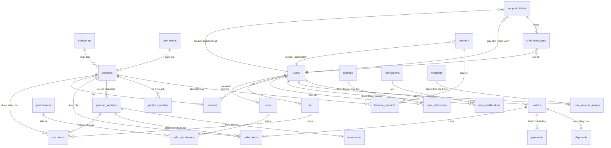

# Sơ đồ Quan hệ Thực thể (ERD)

Tài liệu này mô tả cấu trúc cơ sở dữ liệu và mối quan hệ giữa các bảng trong hệ thống LilaShop bằng sơ đồ Mermaid.

## Sơ đồ ERD

## Mô tả Chi tiết các Thực thể

### Xác thực & Phân quyền (Authentication & Authorization)
- **users**: Lưu trữ thông tin tài khoản của khách hàng và nhân viên, thông tin đăng nhập, số điện thoại và liên kết với vai trò chính của họ.
- **roles**: Các vai trò trong hệ thống định nghĩa quyền truy cập (ví dụ: `ADMIN`, `STAFF`, `CUSTOMER`, `SUPPORT`).
- **permissions**: Các đặc quyền riêng lẻ được ánh xạ tới các vai trò thông qua bảng trung gian `role_permissions`.
- **otp**: Mã xác thực một lần (One-Time Password) dùng cho đăng ký, xác minh email và đặt lại mật khẩu.
- **invalidated_tokens**: Danh sách các JWT token đã bị hủy bỏ (blacklist) để hỗ trợ tính năng đăng xuất tức thì.

### Danh mục & Kho hàng (Catalog & Inventory)
- **products**: Thông tin chi tiết về sản phẩm bao gồm tên, giá cơ bản và mô tả sản phẩm.
- **product_variants**: Các phiên bản cụ thể của sản phẩm (ví dụ: màu sắc, kích thước, dung tích) đi kèm với giá bán riêng của từng phiên bản.
- **product_medias**: Đường dẫn lưu trữ hình ảnh và video của sản phẩm được quản lý thông qua Cloudinary.
- **categories**: Danh mục sản phẩm đa cấp (ví dụ: Chăm sóc da, Son môi).
- **inventories**: Số lượng tồn kho hiện tại liên kết trực tiếp với từng phiên bản sản phẩm.

### Giỏ hàng & Thanh toán (Shopping & Checkout)
- **cart**: Phiên giỏ hàng đang hoạt động của khách hàng.
- **cart_items**: Các sản phẩm/phiên bản được thêm vào giỏ hàng kèm theo số lượng tương ứng.
- **orders**: Bản ghi đơn hàng hoàn chỉnh mô tả các trạng thái mua hàng (Chờ xử lý, Đang xử lý, Đang giao, Đã giao, Đã hủy).
- **order_items**: Chi tiết các sản phẩm, số lượng và giá bán thực tế tại thời điểm đặt hàng.
- **payments**: Theo dõi trạng thái thanh toán (ví dụ: Đang chờ, Đã hoàn thành) thông qua Cổng thanh toán MoMo hoặc Thanh toán khi nhận hàng (COD).
- **shipments**: Theo dõi thông tin giao hàng, địa chỉ giao và trạng thái vận chuyển qua API của Giao Hàng Nhanh (GHN).

### Tiếp thị & Khuyến mãi (Marketing & Promotions)
- **vouchers**: Các mã giảm giá đi kèm với các điều kiện giới hạn số lần sử dụng, thời gian hiệu lực và giá trị đơn hàng tối thiểu.
- **promotions**: Các chương trình khuyến mãi tự động được áp dụng cho toàn bộ danh mục hoặc các sản phẩm cụ thể.
- **banners**: Các slide quảng cáo trên trang chủ hiển thị các chiến dịch tiếp thị đang chạy.

### Hỗ trợ & Phản hồi (Support & Feedback)
- **support_tickets**: Các yêu cầu hoặc khiếu nại do khách hàng gửi lên, được tiếp nhận bởi nhân viên hỗ trợ.
- **chat_messages**: Lịch sử tin nhắn trao đổi trực tiếp gắn liền với từng ticket hỗ trợ.
- **reviews**: Đánh giá xếp hạng sao và phản hồi bằng văn bản của khách hàng đối với các sản phẩm trong danh mục.
