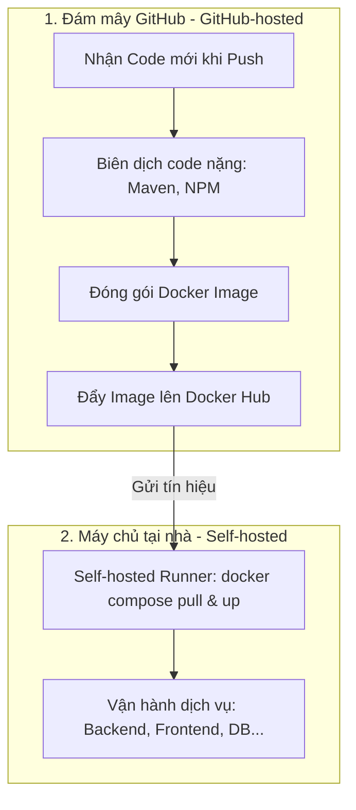

# Tổng Quan Giải Pháp Triển Khai Hybrid CI/CD (LilaShop)

Tài liệu này trình bày tổng quan về kiến trúc hạ tầng và giải pháp triển khai tự động (CI/CD) cho dự án LilaShop. Hệ thống sử dụng mô hình kết hợp **Hybrid Workflow** để giải quyết bài toán tài nguyên phần cứng và bảo mật mạng nội bộ.

---

## 1. Tổng Quan Công Nghệ (Technology Stack)

Hạ tầng triển khai được xây dựng dựa trên sự phối hợp của các công nghệ sau:

- **GitHub Actions (GitHub-hosted Runner)**: Đảm nhận các tác vụ biên dịch mã nguồn (Maven, npm) và đóng gói hình ảnh (Docker image build) trên môi trường đám mây cô lập của GitHub.
- **GitHub Actions (Self-hosted Runner)**: Lắng nghe tín hiệu trực tiếp từ GitHub để tự kích hoạt tiến trình tải và cập nhật dịch vụ cục bộ trên máy chủ nội bộ.
- **Docker & Docker Compose**: Đóng gói và quản lý các dịch vụ độc lập của hệ thống (Backend Spring Boot, Frontend React, Cụm Elasticsearch, Kibana, Filebeat, MySQL).
- **Cloudflare Tunnel (cloudflared)**: Tạo đường hầm kết nối bảo mật trực tiếp từ máy chủ nội bộ lên đám mây Cloudflare mà không cần mở bất kỳ cổng nào (Port Forwarding, DMZ) trên Router mạng gia đình.
- **Nginx Proxy Manager (NPM)**: Đóng vai trò làm Proxy ngược (Reverse Proxy) nội bộ để điều phối lưu lượng truy cập từ Cloudflare Tunnel vào các container Frontend và Backend tương ứng.
- **Docker Hub**: Nơi lưu trữ và phân phối các Docker Image được đóng gói sau mỗi lần build thành công.

---

## 2. Yêu Cầu Hệ Thống (Prerequisites)

Để vận hành hệ thống này, các điều kiện cần có bao gồm:

- **Tên miền riêng**: Tên miền đã mua và được quản lý DNS thông qua Cloudflare (Ví dụ: `linhdev.shop`).
- **Máy chủ nội bộ (Home Server)**: 
  - Hệ điều hành: Ubuntu Server.
  - Cấu hình đề xuất: RAM tối thiểu 4GB.
  - Đã cài đặt sẵn: Docker Engine và Docker Compose.
- **Tài khoản nền tảng**: GitHub (Public Repository), Docker Hub và Cloudflare Zero Trust.

---

## 3. Quy Trình Triển Khai Tổng Quát (Deployment Workflow)

Quy trình tự động hóa hoạt động theo mô hình Hybrid chia làm 2 giai đoạn:

### Chi Tiết Phân Chia Công Việc:

#### Giai đoạn 1: Biên Dịch & Đóng Gói (Chạy trên Đám mây GitHub)
- **Tác vụ**: Khi lập trình viên push mã nguồn mới lên nhánh `main`, máy ảo của GitHub tự khởi chạy để chạy các tác vụ biên dịch mã nguồn Java, build gói tĩnh React và build Docker Image.
- **Ưu điểm**: 
  - Máy chủ nội bộ ở nhà không bị đơ hoặc treo do không phải gánh các tác vụ nặng (Maven/NPM build).
  - Ngăn ngừa rủi ro mã độc chạy trên máy chủ ở nhà nếu dự án nhận Pull Request từ bên ngoài (Public Repo).

#### Giai đoạn 2: Triển Khai Thực Tế (Chạy trên Home Server)
- **Tác vụ**: Sau khi ảnh Docker mới được tải lên Docker Hub, GitHub Actions gửi tín hiệu về Self-hosted Runner trên máy chủ của bạn. Máy chủ chỉ cần tải bản Image hoàn chỉnh về và khởi động lại container tương ứng (mất khoảng 5 giây).
- **Ưu điểm**:
  - Không cần cấu hình IP tĩnh hay mở cổng SSH (port 22) ra Internet, giúp bảo vệ máy chủ khỏi các cuộc tấn công quét cổng (Port Scanning).
  - Vận hành mượt mà tên miền chính thức (`https://linhdev.shop` và `https://www.linhdev.shop`) thông qua đường hầm Cloudflare Tunnel bảo mật cao.
