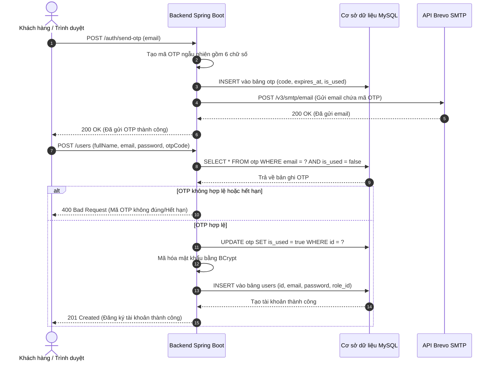
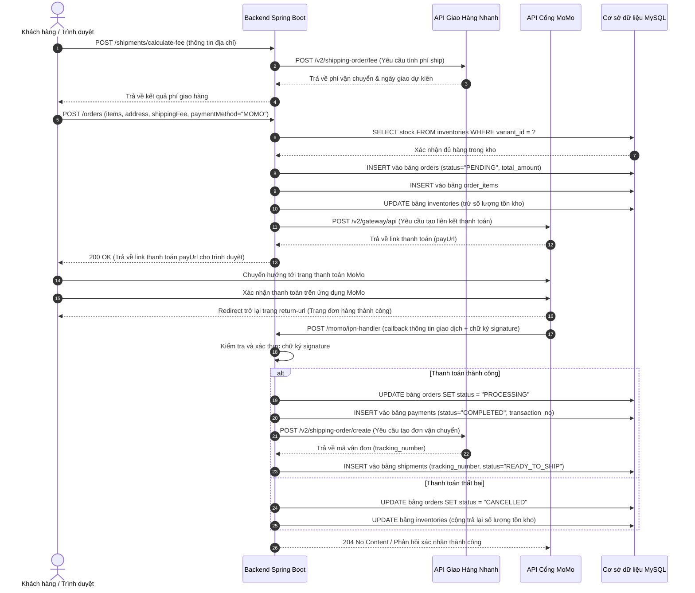
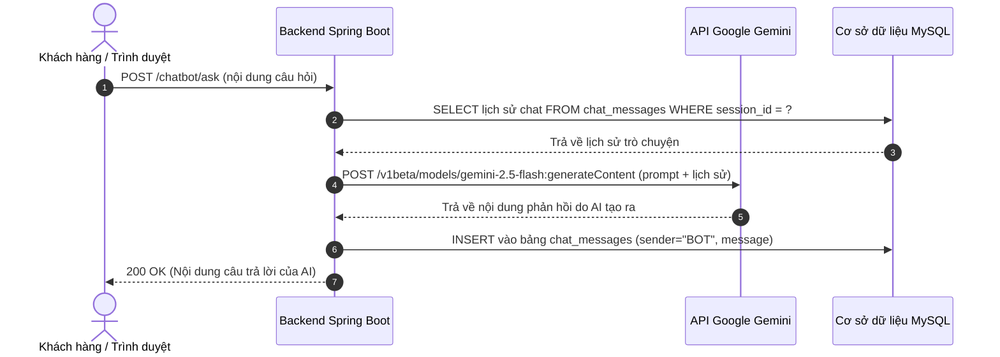

# Sơ đồ Tuần tự (Sequence Diagrams)

Tài liệu này chứa các sơ đồ tuần tự mô tả chi tiết các luồng nghiệp vụ quan trọng trong hệ thống LilaShop, minh họa sự tương tác giữa trình duyệt client, backend Spring Boot, cơ sở dữ liệu MySQL và các API dịch vụ bên thứ ba.

---

## 1. Luồng Đăng ký Tài khoản & Xác thực OTP

Sơ đồ này mô tả chi tiết cách người dùng đăng ký tài khoản mới và xác minh email bằng mã OTP được gửi qua dịch vụ Brevo SMTP.

---

## 2. Luồng Đặt hàng & Thanh toán qua MoMo & Vận chuyển GHN

Sơ đồ này mô tả toàn bộ quá trình mua hàng, bắt đầu từ tính toán phí vận chuyển, tạo đơn hàng, thanh toán qua cổng MoMo cho đến khi nhận được callback (IPN) để kích hoạt tạo vận đơn trên Giao Hàng Nhanh.

---

## 3. Luồng Tương tác Trợ lý Chatbot (Google Gemini AI)

Sơ đồ mô tả quy trình trò chuyện trực tiếp của người dùng với trợ lý AI hỗ trợ được tích hợp trên hệ thống.

